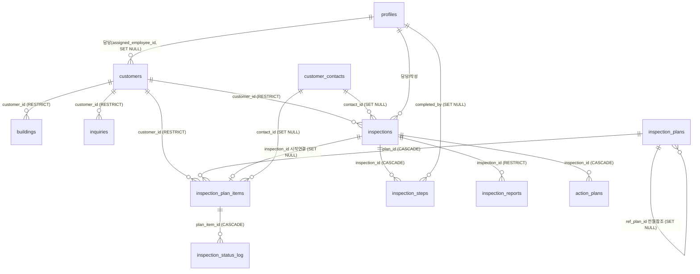

# 소방안전관리 테이블 관계도 (컬럼 주석 포함)

DB(Supabase/PostgreSQL)에서 추출한 소방안전관리 도메인 테이블의 실제 스키마·외래키·컬럼 의미.
추출: 2026-07-10 (information_schema + 코드 용법, `erp/scripts/_dump-fire-schema.mjs` 재실행 가능).
`profiles`(직원)·`customer_contacts`(관계인)는 공통 테이블로 참조만 표시.

## ER 다이어그램 (Mermaid)



## 핵심 흐름 (변경전파맵 PROP과 연결)

```
고객 등록(customers)
   ├─ 건물 자동 생성 → buildings
   └─ 연간계획 생성 → inspection_plans(연·월) ── inspection_plan_items(항목, 12건/년)
                                                     │
   점검일자 확정(PROP-6): plan_item.step1~6_date 계산 (기준일=최초 점검시작일→사용승인일)
   점검 시작(PROP-7):  plan_item ──inspection_id──> inspections 생성
                                     └─ DB 트리거로 inspection_steps 6단계 자동 생성
   단계 완료(PROP-8):  inspection_steps.status + inspection_status_log 동기화
   보고/이행:          inspection_reports(보고서), action_plans(이행계획서)
```

---

## 테이블별 컬럼 주석 (행수는 2026-07-10 dev DB 기준)

### 1. customers — 고객(관리 대상 건물주/업체) · 19컬럼 · 3행
도메인 최상위 뿌리. 계획·점검·건물·문의가 모두 이 고객을 참조.

| 컬럼 | 타입 | 제약 | 주석 |
|---|---|---|---|
| id | uuid | PK | 고객 고유 ID |
| customer_code | text | NOT NULL | 고객 코드(업체 식별 코드, 예: SJ-001) |
| customer_name | text | NOT NULL | 고객(건물)명 |
| contract_date | date | NOT NULL | 계약일 |
| inspection_type | enum | NOT NULL | 점검 유형: 종합 / 작동 / 일반관리 (일반관리는 자동계획 생성 안 함) |
| inspection_category | text | | 점검 대분류(소방안전관리 등) |
| inspection_sub_type | text | | 점검 소분류(종합/작동) |
| use_approval_date | date | | **사용승인일** — 계획 기준일 후보(최초 점검시작일이 없을 때 사용). 점검 주기의 기산점 |
| assigned_employee_id | uuid | FK→profiles [SET NULL] | 담당 직원. 변경 시 미완료 계획·점검에 전파(PROP-2) |
| address / zipcode | text | | 주소 / 우편번호 |
| region_si / region_myeon / region_ri | text | | 지역(시군구/읍면동/리) — 지역별 담당 배정용. 주소검색 시 자동 세팅(화면 입력은 숨김) |
| is_active | boolean | NOT NULL =true | 활성 여부. false=비활성(퇴사 아님, 계약 종료 등) → 미완료 계획 자동취소(PROP-3) |
| notes | text | | 비고 |
| created_by | uuid | FK→profiles [RESTRICT] | 등록자 |
| created_at / updated_at | timestamptz | NOT NULL | 생성/수정 시각 |

### 2. inspection_plans — 월간 점검계획(연·월 컨테이너) · 11컬럼 · 24행
연·월 하나당 1행. 그 달의 모든 고객 점검항목(plan_items)을 담는 그릇.

| 컬럼 | 타입 | 제약 | 주석 |
|---|---|---|---|
| id | uuid | PK | 계획 ID |
| year / month | int | NOT NULL | 계획 연도 / 월 (UNIQUE(year,month)) |
| status | enum | NOT NULL =draft | 계획 상태: draft(작성중) / confirmed(확정) |
| auto_generated | boolean | NOT NULL =false | 자동 생성 여부(고객 등록·크론=true, 수동=false) |
| ref_plan_id | uuid | FK→inspection_plans [SET NULL] | 전월 복사 시 출처 계획(자기참조) |
| confirmed_at | timestamptz | | 확정 시각 |
| notes | text | | 비고 |
| created_by | uuid | FK→profiles [RESTRICT] | 생성자(시스템/관리자) |
| created_at / updated_at | timestamptz | NOT NULL | 생성/수정 시각 |

### 3. inspection_plan_items — 점검계획 항목(개별 점검 건) · 23컬럼 · 42행
전파의 **중심 테이블**. status가 화면 표시(계획중/확정/완료/취소)를 결정. 대부분의 불변식이 이 테이블 대상.

| 컬럼 | 타입 | 제약 | 주석 |
|---|---|---|---|
| id | uuid | PK | 항목 ID |
| plan_id | uuid | FK→inspection_plans [CASCADE] | 소속 월간계획. 계획 삭제 시 함께 삭제 |
| customer_id | uuid | FK→customers [RESTRICT] | 대상 고객 |
| inspection_type / _category / _sub_type | | | 점검 유형(고객에서 복사) |
| plan_type | text | | 항목 종류: special_종합 / special_작동(법정 특별점검) / monthly(정기 자체점검) / event(일반관리) |
| sequence_num | smallint | NOT NULL | 차수(1차/2차). 종합은 6개월 간격 2회 |
| planned_date | date | | 예정일(기준일 규칙으로 자동 계산, 영업일 회피) |
| scheduled_date | date | | **확정일** — 관리자가 점검일자 확정 시 입력. NULL=미확정 |
| step1_date ~ step6_date | date | | 6단계 마감 일정(확정 시 자동 계산). 점검 시작 시 inspection_steps.due_date로 복사 |
| status | enum | NOT NULL =planned | planned(계획) / confirmed(확정) / completed(점검 시작됨) / cancelled(취소) |
| inspection_id | uuid | FK→inspections [SET NULL] | 점검 시작 시 연결. 점검 삭제 시 NULL(→앱이 confirmed로 복귀, GAP-2) |
| assigned_employee_id | uuid | FK→profiles [SET NULL] | 담당 직원(고객 담당과 동기화) |
| contact_id | uuid | FK→customer_contacts [SET NULL] | 현장 관계인 |
| notes | text | | 비고 + **자동취소:원상태 마커**(비활성 자동취소 시 원상태 보존, 재활성 복원용) |
| created_at / updated_at | timestamptz | NOT NULL | 생성/수정 시각 |

### 4. inspections — 점검(실제 실행) · 14컬럼 · 3행
점검 시작 시 plan_item에서 생성. DB 트리거가 이 행 생성과 동시에 6단계(inspection_steps) 자동 생성.

| 컬럼 | 타입 | 제약 | 주석 |
|---|---|---|---|
| id | uuid | PK | 점검 ID |
| customer_id | uuid | FK→customers [RESTRICT] | 대상 고객 |
| inspection_type | enum | NOT NULL | 점검 유형 |
| inspection_start_date | date | NOT NULL | **점검 시작일** — 계획 기준일의 최우선 소스(사용승인일보다 우선) |
| notification_date | date | | 통보일 |
| sequence_num | smallint | NOT NULL =1 | 차수 |
| year | int | | 연도(생성 컬럼 — insert 불가) |
| status | enum | NOT NULL =scheduled | scheduled / in_progress / completed / cancelled |
| assigned_employee_id | uuid | FK→profiles [RESTRICT] | 담당 직원(점검자). RESTRICT라 담당 있으면 직원 하드삭제 불가 |
| contact_id | uuid | FK→customer_contacts [SET NULL] | 현장 관계인 |
| notes | text | | 비고 |
| created_by | uuid | FK→profiles [RESTRICT] | 생성자 |
| created_at / updated_at | timestamptz | NOT NULL | 생성/수정 시각 |

### 5. inspection_steps — 점검 6단계 체크리스트 · 13컬럼 · 18행
점검당 6행(1~6단계). 순서대로만 완료 가능(이전 단계 미완료 시 거부).

| 컬럼 | 타입 | 제약 | 주석 |
|---|---|---|---|
| id | uuid | PK | 단계 ID |
| inspection_id | uuid | FK→inspections [CASCADE] | 소속 점검. 점검 삭제 시 함께 삭제 |
| step_num | smallint | NOT NULL | 단계 번호 1~6 (1:점검일자확정 … 6:이행완료보고서 제출) |
| name_ko | text | NOT NULL | 단계명(한글) |
| due_days | smallint | | 기준일로부터의 소요일(예: +15일) |
| is_working_days | boolean | | 영업일 기준 여부 |
| due_date | date | | 마감일(확정일 기준 계산, 1단계 완료 시 실제 점검일 기준 재계산) |
| status | enum | NOT NULL =pending | pending / completed / (파생 overdue는 화면 계산) |
| completed_at | timestamptz | | 완료 시각 |
| completed_by | uuid | FK→profiles [SET NULL] | 완료 처리 직원 |
| notes | text | | 비고 |
| created_at / updated_at | timestamptz | NOT NULL | 생성/수정 시각 |

### 6. inspection_status_log — 점검 상태 이력(단계별 일자·SMS) · 16컬럼 · 3행
plan_item당 1행. 모니터링·보고서 제출현황 화면의 데이터 소스(P-19 동기화 대상).

| 컬럼 | 타입 | 제약 | 주석 |
|---|---|---|---|
| id | uuid | PK | 로그 ID |
| plan_item_id | uuid | FK→inspection_plan_items [CASCADE] | 대상 계획 항목 |
| inspection_date | date | | 1단계: 실제 점검일 |
| report_submitted_at | date | | 2단계: 배치확인서/보고서 제출일 |
| sent_at | date | | 3단계: 관계인 송부일 |
| filed_at | date | | 4단계: 소방서 계출일 |
| step5_completed_at | date | | 5단계: 소방보수 완료일 |
| step6_completed_at | date | | 6단계: 이행완료보고서 제출일 |
| sms_confirmed / sms_sent_at / sms_content / sms_sender_phone / sms_recipients | | | SMS 발송 이력(확인여부·시각·내용·발신·수신자 JSON) |
| updated_by | uuid | FK→profiles [SET NULL] | 갱신 직원 |
| created_at / updated_at | timestamptz | NOT NULL | 생성/수정 시각 |

### 7. inspection_reports — 점검 보고서(제출 파일) · 14컬럼 · 0행
- FK: `inspection_id → inspections [RESTRICT]`, `submitted_by → profiles [SET NULL]`
- 주요 컬럼: `report_type`, `customer_code/name`(스냅샷), `file_name/path/size/mime_type`, `submitted_at`

### 8. action_plans — 이행계획서 · 9컬럼 · 0행
- FK: `inspection_id → inspections [CASCADE]`, `created_by → profiles [RESTRICT]`
- 주요 컬럼: `plan_file_url`, `completion_target_date`(이행 목표일), `submitted_at`, `sent_at`

### 9. inquiries — 문의요청 · 19컬럼 · 0행
- FK: `customer_id → customers [RESTRICT]`, `created_by → profiles [RESTRICT]`, `resolved_by → profiles [SET NULL]`
- 주요 컬럼: `inquiry_type`, `title/content`, `contact_name/phone`, `status`, `resolution_notes`, `resolved_at`

### 10. 참조·마스터 테이블
- **inspection_sheets** — 점검표 양식(10컬럼·1행): `sheet_code`, `sheet_name`, `version`, `inspection_type`, `is_active`. FK: `created_by → profiles [SET NULL]`
- **building_purposes** — 건물 용도 분류 마스터(4컬럼·11행): `name`, `sort_order`. FK 없음
- **holidays** — 공휴일(6컬럼·22행): `date`, `name`, `is_national`(국가공휴일/자체휴무), `year`. 예정일 영업일 계산에 사용. FK 없음
- **buildings** — 건물 상세(26컬럼·3행): 건축물대장 연동 필드(면적·층수·구조·승강기·세대수 등), `ledger_synced_at`. FK: `customer_id → customers [RESTRICT]`, `created_by → profiles [RESTRICT]`

---

## 삭제 규칙(ON DELETE) 요약 — 데이터 정합의 핵심

| 관계 | 규칙 | 의미 |
|---|---|---|
| inspection_plans → inspection_plan_items | CASCADE | 계획 삭제 시 항목 함께 삭제 |
| inspections → inspection_steps | CASCADE | 점검 삭제 시 6단계 함께 삭제 |
| inspections → action_plans | CASCADE | 점검 삭제 시 이행계획서 삭제 |
| inspection_plan_items → inspection_status_log | CASCADE | 항목 삭제 시 상태이력 삭제 |
| inspections → inspection_plan_items (inspection_id) | **SET NULL** | 점검 삭제 시 항목 연결만 끊김 → **GAP-2**에서 앱이 confirmed로 되돌리도록 보강 |
| customers → (buildings/inspections/plan_items/inquiries) | RESTRICT | 참조 있으면 고객 하드삭제 불가(소프트 삭제=is_active) |
| profiles → customers/plan_items (assigned) | SET NULL | 직원 삭제 시 담당 비움 (단, 이력 있는 직원은 앱에서 삭제 차단) |
| inspections → profiles (assigned/created) | RESTRICT | 점검 담당·작성자 있으면 직원 하드삭제 불가 |

## 관련 불변식 (check-plan-invariants.mjs)
| 불변식 | 지키는 관계 |
|---|---|
| INV-P1 | 과거월 미처리 정기(monthly) 항목 0건 |
| INV-P2 | planned_date < 기준일 항목 0건 (2차 역행 방지) |
| INV-P3 | 자동취소 마커 보유 항목은 status=cancelled |
| INV-P4/P5 | 비활성 직원이 담당인 미완료 항목/고객 0건 (assigned SET NULL 보완) |
| INV-P6 | 진행중 inspection과 연결 plan_item의 담당 일치 |
| INV-P7 | completed plan_item은 반드시 inspection에 연결 (inspection_id SET NULL 갭=GAP-2 보완) |
