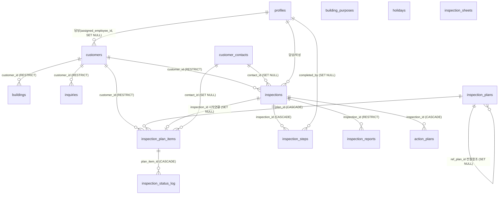

# 소방안전관리 테이블 관계도

DB(Supabase/PostgreSQL)에서 추출한 소방안전관리 도메인 테이블의 실제 스키마·외래키 관계.
추출: 2026-07-10 (information_schema 조회, `erp/scripts/_dump-fire-schema.mjs` 재실행 가능).
`profiles`(직원)·`customer_contacts`(관계인)는 공통 테이블로, 참조만 표시.

## ER 다이어그램 (Mermaid)



## 핵심 흐름 (변경전파맵과 연결)

```
고객 등록(customers)
   ├─ 건물 자동 생성 → buildings
   └─ 연간계획 생성 → inspection_plans(연·월) ─┬─ inspection_plan_items(항목, 12건/년)
                                                │
   점검일자 확정(PROP-6): plan_item.step1~6_date 계산
   점검 시작(PROP-7): plan_item ──inspection_id──> inspections 생성
                                    └─ DB 트리거로 inspection_steps 6단계 생성
   단계 완료(PROP-8): inspection_steps.status + inspection_status_log 동기화
   보고서/이행: inspection_reports, action_plans
```

## 테이블 상세 (행수는 2026-07-10 dev DB 기준)

### 1. customers — 고객(관리 대상 건물주/업체) · 19컬럼 · 3행
도메인의 최상위. 소방 계획·점검·건물·문의의 뿌리.
- 주요 컬럼: `customer_code`, `customer_name`, `inspection_type`(종합/작동/일반관리),
  `inspection_category`, `inspection_sub_type`, `use_approval_date`(사용승인일=기준일 후보),
  `assigned_employee_id`(담당), `is_active`, `region_si/myeon/ri`(지역별 배정용)
- FK: `assigned_employee_id → profiles [SET NULL]`, `created_by → profiles [RESTRICT]`

### 2. buildings — 건물(고객별 건축물 상세) · 26컬럼 · 3행
- FK: `customer_id → customers [RESTRICT]`, `created_by → profiles [RESTRICT]`
- 건축물대장 연동 컬럼(면적·층수·구조·승강기 등), `ledger_synced_at`

### 3. inspection_plans — 월간 점검계획(연·월 단위 컨테이너) · 11컬럼 · 24행
- 주요 컬럼: `year`, `month`, `status`(draft/confirmed), `auto_generated`, `confirmed_at`
- FK: `created_by → profiles [RESTRICT]`, `ref_plan_id → inspection_plans [SET NULL]`(전월 복사 출처, 자기참조)

### 4. inspection_plan_items — 점검계획 항목(계획의 개별 점검 건) · 23컬럼 · 42행
전파의 중심 테이블. 상태(planned/confirmed/completed/cancelled)로 화면 표시 결정.
- 주요 컬럼: `plan_type`(special_종합/special_작동/monthly/event), `sequence_num`(1·2차),
  `planned_date`, `scheduled_date`(확정일), `step1_date~step6_date`(6단계 계산 일정),
  `status`, `notes`(자동취소:상태 마커), `assigned_employee_id`
- FK: `plan_id → inspection_plans [CASCADE]`, `customer_id → customers [RESTRICT]`,
  `inspection_id → inspections [SET NULL]`(점검 시작 시 연결), `assigned_employee_id → profiles [SET NULL]`,
  `contact_id → customer_contacts [SET NULL]`

### 5. inspections — 점검(실제 실행된 점검) · 14컬럼 · 3행
- 주요 컬럼: `inspection_type`, `inspection_start_date`(기준일 우선 소스), `sequence_num`,
  `status`(scheduled/in_progress/completed/cancelled), `year`(생성 컬럼)
- FK: `customer_id → customers [RESTRICT]`, `assigned_employee_id → profiles [RESTRICT]`,
  `contact_id → customer_contacts [SET NULL]`, `created_by → profiles [RESTRICT]`

### 6. inspection_steps — 점검 6단계 체크리스트 · 13컬럼 · 18행
- 주요 컬럼: `step_num`(1~6), `name_ko`, `due_date`, `is_working_days`, `status`, `completed_at/by`
- FK: `inspection_id → inspections [CASCADE]`(점검 삭제 시 함께 삭제), `completed_by → profiles [SET NULL]`

### 7. inspection_status_log — 점검 상태 이력(단계별 일자·SMS) · 16컬럼 · 3행
- 주요 컬럼: `inspection_date`, `report_submitted_at`, `sent_at`, `filed_at`,
  `step5_completed_at`, `step6_completed_at`, `sms_*`(발송 이력)
- FK: `plan_item_id → inspection_plan_items [CASCADE]`, `updated_by → profiles [SET NULL]`

### 8. inspection_reports — 점검 보고서(제출 파일) · 14컬럼 · 0행
- FK: `inspection_id → inspections [RESTRICT]`, `submitted_by → profiles [SET NULL]`

### 9. action_plans — 이행계획서 · 9컬럼 · 0행
- FK: `inspection_id → inspections [CASCADE]`, `created_by → profiles [RESTRICT]`

### 10. inquiries — 문의요청 · 19컬럼 · 0행
- FK: `customer_id → customers [RESTRICT]`, `created_by → profiles [RESTRICT]`, `resolved_by → profiles [SET NULL]`

### 11. 참조·마스터 테이블
- **inspection_sheets** — 점검표 양식(10컬럼·1행). `created_by → profiles [SET NULL]`
- **building_purposes** — 건물 용도 분류 마스터(4컬럼·11행). FK 없음
- **holidays** — 공휴일(6컬럼·22행). 예정일 영업일 계산에 사용. FK 없음

## 삭제 규칙(ON DELETE) 요약 — 데이터 정합의 핵심

| 관계 | 규칙 | 의미 |
|---|---|---|
| inspection_plans → inspection_plan_items | CASCADE | 계획 삭제 시 항목 함께 삭제 |
| inspections → inspection_steps | CASCADE | 점검 삭제 시 6단계 함께 삭제 |
| inspections → action_plans | CASCADE | 점검 삭제 시 이행계획서 삭제 |
| inspection_plan_items → inspection_status_log | CASCADE | 항목 삭제 시 상태이력 삭제 |
| inspections → inspection_plan_items (inspection_id) | SET NULL | **점검 삭제 시 항목 연결만 끊김** → GAP-2에서 앱이 confirmed로 되돌리도록 보강 |
| customers → (buildings/inspections/plan_items/inquiries) | RESTRICT | 참조가 있으면 고객 하드삭제 불가(소프트 삭제=is_active) |
| profiles → customers/plan_items (assigned) | SET NULL | 직원 삭제 시 담당 비움 (단, 이력 있는 직원은 앱에서 삭제 차단) |
| inspections → profiles (assigned/created) | RESTRICT | 점검 담당·작성자가 있으면 직원 하드삭제 불가 |

## 관련 불변식 (check-plan-invariants.mjs)
- INV-P4/P5: 비활성 직원이 담당인 미완료 항목 금지 (SET NULL이라 데이터는 남지만 표시 정합 위해)
- INV-P6: 진행중 점검과 연결 항목의 담당 일치
- INV-P7: completed 항목은 반드시 inspection에 연결 (SET NULL 갭 = GAP-2 보완 대상)
